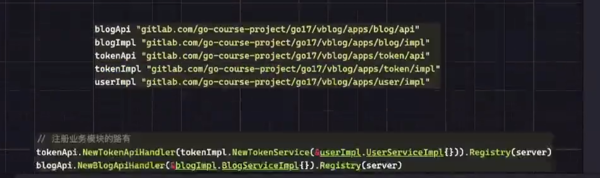
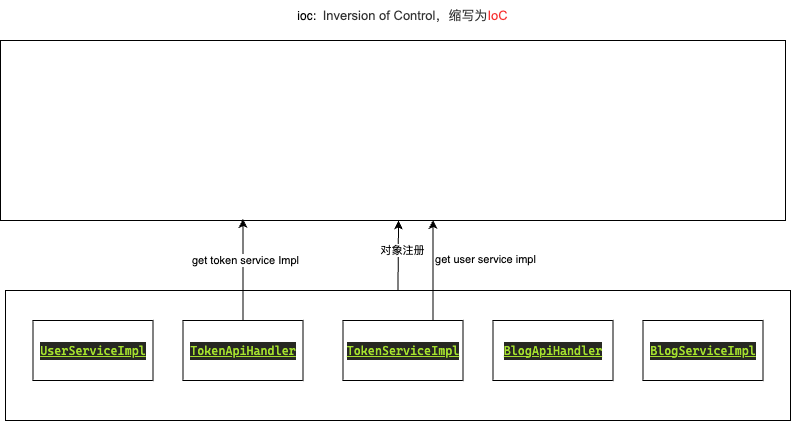
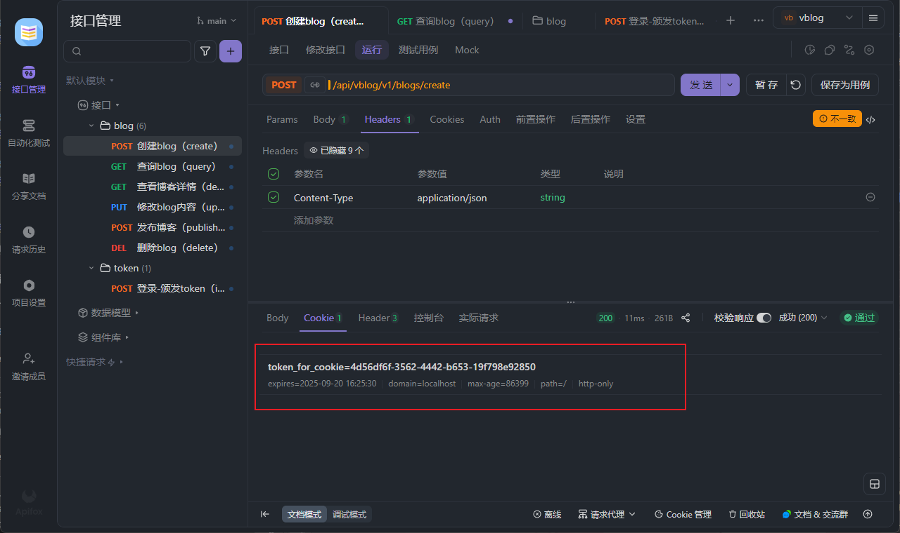

# vblog
engined by gin gorm and vue

## OOP基本组织
在这个项目中主要涉及到了5个对象
1. TokenApiHandler
2. TokenServiceImpl
3. BlogApiHandler
4. BlogServiceImpl
5. UserServiceImpl



```go
blogApi.NewBlogApiHandler(&blogImpl.BlogServiceImpl{}).Registry(ge)
tokenApi.NewBTokenAPIHandler(tokenImpl.NewTokenServiceImpl(&userImpl.UserServiceImpl{})).Registry(ge)

token/impl.go
var TokenService token.Service = &TokenServiceImpl{}

type TokenServiceImpl struct {
    UserSvc user.AdminService
}

func NewTokenServiceImpl(user user.AdminService) token.Service {
    return &TokenServiceImpl{
        UserSvc: user,
    }
}

token/api.go
type TokenAPIHandler struct {
    token token.Outer
}

func NewBTokenAPIHandler(tokenService impl.TokenServiceImpl) *TokenAPIHandler {
    return &TokenAPIHandler{
        token: &tokenService,
    }
}
```

OOP的思想实现，可以将每个对象的构造函数中定义形参，类型就是属性类型，将属性设置转移到外部调用时确定
这个就是OOP的依赖注入思想

定义构造函数的时候最好就是不要将属性定死，而是通过上面的方式去组织代码逻辑

并且在返回的时候返回接口更容易扩展

## IoC托管

将5个对象托管到IoC容器中，后续互相调用和IoC容器请求即可

```go
token/interface.go
const (
	AppName = "blogs"
)

// 对外的构造函数
func GetService() Service {
	// 调用ioc池子中指定名称的对象，这里就是在调用blog中的impl
	return ioc.Controller().Get(AppName).(Service)
}

token/impl.go
func init() {
// 注册到ioc池子
ioc.Controller().Registry(&TokenServiceImpl{})
}

type TokenServiceImpl struct {
// 继承mcube框架的Object接口实现，从而能够注册	
    ioc.ObjectImpl
// 调用DescribeUser查询用户
    UserSvc user.AdminService
}

// 设置注册到IoC容器的名字
func (*TokenServiceImpl) Name() string {
    return token.AppName
}

// 重写ioc框架的Init方法实现服务注册，等于是在main中直接调用registry方法注册路由
func (t *TokenAPIHandler) Init() error {
	// 通过IoC池子获取属性
    t.token = token.GetService()
    t.Registry(server.GinServer)
    return nil
}

func (t *TokenAPIHandler) Registry(ge *gin.Engine) {
    server := ge.Group("/vblog/api/v1/tokens")
    server.POST("/", t.IssueToken)
    server.POST("/revolk", t.RevolkToken)
    server.POST("/refresh", t.RefreshToken)
}

// 具体调用
ins, err := token.GetService().RevolkToken(ctx, it)
```
后续其他模块中如果想要调用impl的方法直接token.GetService即可，因为此时已经将对象实例注册到了Ioc池子中

### gin托管到IoC
```go
func (b *BlogApiHandler) Init() error {
	b.blog = blog.GetService()
	// url路径一般为/api/mcube_service/v1/hello_module/
	r := ioc_gin.ObjectRouter(b)
	r.Use(middleware.Auth)
	r.POST("/create", b.CreateBlog)
	r.GET("/query", b.QueryBlog)
	r.GET("/describe/:id", b.DescribeBlog)
	r.PUT("/update/:id", b.UpdateBlog)
	r.POST("/publish/:id", b.PublishBlog)
	r.DELETE("/delete/:id", b.DeleteBlog)
	return nil
}
```
主要就是调用mcube中封装的server来实现注册中间件调用等操作，然后在main中同样可以支持server.Run的方式启动服务

```go
if err := server.Run(context.Background()); err != nil {
    log.Println(err)
}

cmd.Start()
```
cmd.Start是cobra框架对server.Run的封装，支持命令行的方式启动

## 优化部分

### Cookie
如果每次请求都需要手动的携带token信息会比较麻烦，所以此时可以设置cookie并且在请求对应资源的时候自动携带来解决问题

cookie颁发的两个条件
1. 颁发token的时候是否可以直接设置cookie
```go
token/enum.go
const (
	CookieName = "token_for_cookie"
)

token/model.go
func (t *Token) AccessTokenExpireTTL() int {
// 如果过期时间为空，那么cookie持续时间为0
    if t.AccessTokenExpireAt == nil {
        return 0
}
// 如果不为空，那么就根据现在到过期时间还有多久返回
    return int(t.AccessTokenExpireAt.Sub(time.Now()).Seconds())
}

token/api.go
// 获取cookie作用的域名信息，配合etc目录的toml文件的app表的address实现
domain := application.Get().Domain()
log.L().Debug().Msgf("cookie value=%v", domain)
// 通过gin的setcookie方法得到cookie，内容就是用户携带的token
// path表示cookie的作用路径，/表示对所有url都起作用
// domain表示客户端访问指定域名的时候浏览器才会发送cookie
// secure表示仅https
ctx.SetCookie(token.CookieName, ins.AccessToken, ins.AccessTokenExpireTTL(), "/", domain, false, true)
```
path指定为/就是后续指定域名的所有子域名都会触发携带cookie信息

这里指定的domain项目中通过etc/application.toml中的[app]表的address属性设置，两个必须相同，所以通过变量的方式传递
用来判断用户访问什么url前缀的时候才会自动携带cookie信息

2. 获取的token是否可以当做cookie的值使用
```go
middleware/auth.go
func Auth(c *gin.Context) {
    ......
	if len(tkList) == 2 {
		accessToken = tkList[1]
	}

	// 如果accessToken为空就提取cookie作为accesstoken
	if accessToken == "" {
		// 提取gin.Context对象携带的cookie信息
		ck, err := c.Cookie(token.CookieName)
		if err != nil {
			response.Failed(c, err)
			return
		} else {
			accessToken = ck
		}
	}
	tk, err := impl.TokenService.ValidateToken(c.Request.Context(), token.NewValidateTokenRequest(accessToken))
    ......
	}
}
```
这样就实现了自动携带cookie并且accesstoken设置为cookie的值，因为本身就是用accesstoken作为cookie的value，所以后续鉴权流程都可以过



## 优雅关闭
直接关闭Gin的话会导致还没有完成的连接直接中断，可以通过优雅关闭的方式进行处理

Gin本身不支持优雅关闭的方式，但是因为gin.Engine实现了标准库的http.Handler接口，所以可以配合http.Server实现优雅关闭功能
```go
h := &http.Server{}
if err := h.Shutdown(ctx); err != nil {
    response.Failed(ctx, err)
    return
}
```
当检测到了一些特殊的信号时例如ctrl c等导致服务进程停止，那么此时不会马上关闭而是先停止接受信的请求并且将未处理的连接处理完成关闭之后才会停止进程

## DI 依赖注入
通过配置文件的内容获取对象实例，仅需要通过结构体指定tag的形式

具体实现的话就是通过toml、json、yaml库的unmarshal方法实现对文件内容的反序列化

```go
etc/application.toml文件
# mcube IoC注册的名字对应表名
[token]
token_expire_ttl="3600"

token/impl.go
type TokenServiceImpl struct {
TokenExpireTTL int `json:"token_expire_ttl" toml:"token_expire_ttl"`
}
```

这里因为是直接将这个TokenServiceImpl对象注册到了mcube的IoC容器中，所以基于IoC的功能就可以实现到toml、env、json、yaml等配置文件的内容解析和读取
主要是依赖于tag属性
```go
router := gin.Default()
router.GET("/", func(ctx *gin.Context) {
    time.Sleep(2 * time.Second)
    ctx.JSON(http.StatusOK, gin.H{"message": "hello world"})
})
srv := &http.Server{
    Addr:    "localhost:8080",
    Handler: router,
}
go func() {
    if err := srv.ListenAndServe(); err != nil && err != http.ErrServerClosed {
        log.Fatalf("listen : %s\n", err)
    }
}()
quit := make(chan os.Signal, 1)
signal.Notify(quit, syscall.SIGINT, syscall.SIGTERM)
<-quit
log.Println("shutdown server")
_, cancel := context.WithTimeout(context.Background(), 5*time.Second)
defer cancel()
if err := srv.Shutdown(ctx); err != nil {
    log.Fatalf("shutdown server :%s\n", err)
}
log.Println("server shutdown log out")
```